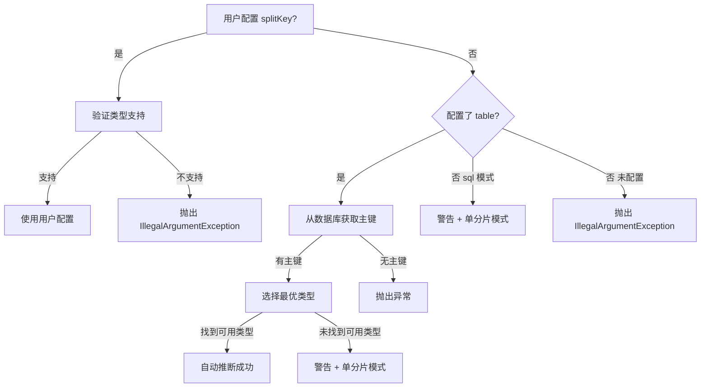

# JDBC Source splitKey 自动推断设计文档审查报告

审查日期：2026-04-08
审查角色：Senior Code Reviewer
审查文档：`docs/superpowers/specs/2026-04-08-jdbc-source-splitkey-auto-inference-design.md`

---

## 一、设计完整性审查

### 1.1 缺失的配置兼容性处理细节

**问题级别：Important**

设计文档在第31行声明"不向后兼容，旧参数 `splitColumn` 被静默忽略"，但没有明确说明实现细节：

1. 是否需要保留读取旧参数 `splitColumn` 的代码逻辑（向后兼容但警告）？
2. 还是直接删除旧参数读取逻辑（完全不向后兼容）？
3. 如果用户配置了旧的 `splitColumn`，是否应该抛出明确的废弃警告？

**现状分析：**

- 当前代码 `JdbcSource.java` 第49行使用 `config.getString("splitColumn")`
- 文档未明确说明迁移策略，开发者可能困惑

**改进建议：**
在"配置参数变更"章节补充向后兼容策略：

```markdown
**向后兼容策略：**

- 删除旧参数 `splitColumn` 的读取逻辑，完全不支持向后兼容
- 用户配置 `splitColumn` 时会被静默忽略（不报错也不生效）
- 优点：代码简洁，避免参数混乱
- 缺点：用户需要主动迁移配置文件

**可选替代方案：**
保留旧参数读取，但发出废弃警告：

```java
if (config.getString("splitColumn") != null) {
    log.warn("参数 'splitColumn' 已废弃，请使用 'splitKey'");
}
```

```

### 1.2 JdbcSourceConfig 文件状态描述不准确

**问题级别：Important**

设计文档第190-207行描述"JdbcSourceConfig.java"时标注为"修改"，但实际上：
- 文件已存在（`flink-etl-source-jdbc/src/main/java/com/etl/source/jdbc/config/JdbcSourceConfig.java`）
- 当前使用 `splitColumn` 字段名
- 文档应明确标注为"修改现有文件"而非"新增"

**改进建议：**
将"影响文件清单"中的描述更准确化：
```markdown
| `JdbcSourceConfig.java` | 字段重命名 | `splitColumn` → `splitKey`，注释更新 |
```

### 1.3 缺失异常类包路径确认

**问题级别：Suggestion**

文档第142行指定 `NoPrimaryKeyException.java` 文件位置：

```markdown
**文件位置：** `flink-etl-core/src/main/java/com/etl/core/exception/NoPrimaryKeyException.java`
```

但未确认 `com.etl.core.exception` 包是否已存在。建议补充说明：

- 如果包不存在，需要创建 `exception` 目录
- 如果包已存在，说明与现有异常类的关系

**验证建议：** 补充包结构说明或先执行 `ls` 确认目录存在性。

---

## 二、技术准确性审查

### 2.1 类型优先级选择逻辑存在潜在问题

**问题级别：Important**

文档第319-343行的 `selectOptimalSplitKey()` 方法实现存在以下问题：

**问题1：主键列遍历顺序依赖 Map 顺序**

代码逻辑：

```java
for(int preferredType :typePriority){
        for(
Map.Entry<String, Integer> entry :primaryKeys.

entrySet()){
        if(entry.

getValue() ==preferredType){
        return entry.

getKey();  // 首次匹配即返回
        }
                }
                }
```

**潜在问题：**

- `SqlUtils.getPrimaryKey()` 返回的是 `HashMap`（见 `SqlUtils.java` 第80行）
- `HashMap` 不保证遍历顺序（即使 JDK 8+ 有改进，也不应依赖）
- 当复合主键中有多个相同优先级类型的列（例如：`(id1 BIGINT, id2 BIGINT)`），返回结果可能不确定

**改进建议：**
方案1：使用 LinkedHashMap 保证主键顺序（按 KEY_SEQ）

```java
// SqlUtils.getPrimaryKey() 第80行
Map<String, Integer> result = new LinkedHashMap<>();  // 改为 LinkedHashMap
```

方案2：补充文档说明，明确复合主键的歧义处理

```markdown
**复合主键歧义处理：**

- 如果多个主键列具有相同的优先级类型（例如 `(id1 BIGINT, id2 BIGINT)`）
- 返回数据库主键定义中的第一列（KEY_SEQ = 1）
- **前提：** SqlUtils.getPrimaryKey() 必须使用 LinkedHashMap 并按 KEY_SEQ 排序
```

**当前 SqlUtils 问题：**

- `SqlUtils.java` 第80行使用 `HashMap`，不保证 KEY_SEQ 顺序
- 文档注释第65行说"按 KEY_SEQ 顺序排列"，但实现不一致

**必须修复：**
设计文档应明确要求 `SqlUtils.getPrimaryKey()` 修改为使用 `LinkedHashMap`：

```java
// SqlUtils.java 第80行修改
Map<String, Integer> result = new LinkedHashMap<>();  // 保证主键顺序
```

### 2.2 Pair 导入依赖未明确声明

**问题级别：Suggestion**

设计文档第214行导入 `org.apache.commons.lang3.tuple.Pair`，但未说明：

- 项目是否已有 commons-lang3 依赖？
- 如果没有，需要在哪个 pom.xml 添加？

**验证结果：**

- 检查 `JdbcSource.java` 第14行已导入 `org.apache.commons.lang3.tuple.Pair`
- 说明 commons-lang3 已通过 Flink 依赖传递存在
- 但设计文档应明确说明这一点

**改进建议：**
在代码实现设计章节补充说明：

```markdown
**依赖说明：**

- `org.apache.commons.lang3.tuple.Pair` 已通过 Flink 依赖传递存在
- 无需额外添加 Maven 依赖
```

### 2.3 异常信息格式化参数未正确传递

**问题级别：Critical**

文档第121行的警告信息：

```markdown
| 配置了 table 但表无主键 | `"表 '{table}' 没有主键，无法自动推断 splitKey。请手动配置 splitKey 参数或为表添加主键"` |
```

但在第301行实现代码中：

```java
throw new RuntimeException(
        String.format("表 '%s' 没有主键，无法自动推断 splitKey。请手动配置 splitKey 参数或为表添加主键", e.getTableName()));
```

**问题分析：**

- `NoPrimaryKeyException` 构造函数第156行已经格式化了错误信息：`String.format("表 '%s' 没有主键", tableName)`
- 第301行再次格式化会导致：`"表 '表名 没有主键' 没有主键，无法..."` （双重格式化）

**改进建议：**
修改异常处理逻辑，避免双重格式化：

方案1：直接使用异常消息

```java
throw new RuntimeException(
        String.format("%s，无法自动推断 splitKey。请手动配置 splitKey 参数或为表添加主键", e.getMessage()));
```

方案2：修改 `NoPrimaryKeyException` 构造函数，不格式化消息

```java
public NoPrimaryKeyException(String tableName) {
    super(tableName);  // 只存储 tableName
    this.tableName = tableName;
}

// 使用时格式化
catch(
NoPrimaryKeyException e){
        throw new

RuntimeException(
        String.format("表 '%s' 没有主键，无法自动推断 splitKey...", e.getTableName()));
        }
```

**推荐方案1：** 修改第301行，使用 `e.getMessage()` 而非 `e.getTableName()`。

### 2.4 枚举类型顺序定义不明确

**问题级别：Suggestion**

文档第321-331行定义类型优先级数组：

```java
int[] typePriority = {
        Types.BIGINT,
        Types.INTEGER,
        Types.SMALLINT,
        Types.TINYINT,
        Types.DECIMAL,
        Types.NUMERIC,
        Types.FLOAT,
        Types.REAL,
        Types.DOUBLE
};
```

**潜在问题：**

- `Types.DECIMAL` 和 `Types.NUMERIC` 在 JDBC 中通常表示相同类型（都是 NUMERIC）
- `Types.FLOAT`、`Types.REAL`、`Types.DOUBLE` 浮点类型的优先级排序理由未说明
- 代码未处理 JDBC 类型别名或数据库方言差异

**改进建议：**
补充设计说明，解释优先级排序理由：

```markdown
**类型优先级排序理由：**

1. BIGINT：范围最大（-2^63 到 2^63-1），最适合大数据量分片
2. INTEGER：范围适中（-2^31 到 2^31-1），常用主键类型
3. SMALLINT/TINYINT：范围较小，适合小表
4. DECIMAL/NUMERIC：精确数值，通常用于货币字段，分片效率较低
5. FLOAT/REAL/DOUBLE：浮点类型，不推荐用于分片（精度问题），但作为兼容选项

**注意：** DECIMAL 和 NUMERIC 在 JDBC 中类型值不同（Types.DECIMAL=3, Types.NUMERIC=2），但语义相同。
```

---

## 三、可实现性审查

### 3.1 缺失参数校验完整性检查

**问题级别：Important**

设计文档的 `inferSplitKey()` 方法缺少以下校验：

1. `table` 和 `sql` 参数是否已校验？
2. `url`、`username`、`password` 连接参数是否有效？
3. 数据库连接失败的异常处理？

**现状分析：**

- `JdbcSource.java` 第34行已校验 `url`
- 第46-48行读取 `table` 和 `sql`
- 但未校验 `table` 和 `sql` 至少配置一个

**改进建议：**
在构造函数开始部分补充参数校验：

```java
// 1. 解析基础配置参数
String url = Preconditions.checkNotNull(config.getString("url"), "url is null");
String username = config.getString("username");
String password = config.getString("password");
String table = config.getString("table");
String sql = config.getString("sql");

// 补充参数校验
Preconditions.

checkArgument(table !=null||sql!=null,
    "table 和 sql 至少配置一个");
```

然后简化 `inferSplitKey()` 方法第312行的重复校验。

### 3.2 测试设计缺少边界条件场景

**问题级别：Important**

测试设计表格（第369-380行）缺少以下边界条件测试：

1. **空主键 Map 场景**：`SqlUtils.getPrimaryKey()` 返回空 Map（不应发生，但需防御）
2. **数据库连接失败场景**：推断过程中连接超时或权限不足
3. **列名大小写敏感场景**：不同数据库的主键列名大小写处理
4. **splitKey 列不存在场景**：用户配置的 splitKey 列名不存在于表或 SQL 结果
5. **schema 权限不足场景**：用户没有访问 DatabaseMetaData 的权限

**改进建议：**
补充测试场景：

```markdown
| 场景 | 输入 | 预期结果 |
|------|------|---------|
| 用户配置 splitKey 列不存在 | `splitKey: "non_exist"` | 抛出 RuntimeException（JdbcDialect.getColumnType 失败） |
| 数据库连接超时 | 推断时连接失败 | 抛出 RuntimeException，提示连接失败 |
| 表名大小写差异 | MySQL 表名大小写敏感 | 自动适配数据库大小写规则 |
| 用户无 metadata 权限 | 无主键查询权限 | 抛出 RuntimeException，提示权限不足 |
```

### 3.3 缺失日志级别规范说明

**问题级别：Suggestion**

代码中使用了多种日志级别，但未明确规范：

- 第278行：`log.info()` - 用户配置 splitKey
- 第296行：`log.info()` - 自动推断 splitKey
- 第289行：`log.warn()` - 主键类型不支持
- 第307行：`log.warn()` - sql 模式未配置 splitKey
- 第54行（现有代码）：`log.warn()` - 未配置 splitColumn

**改进建议：**
补充日志级别规范：

```markdown
**日志级别规范：**

- `log.info()`: 正常推断结果（用户配置、自动推断成功）
- `log.warn()`: 需要用户关注的降级场景（单分片模式）
- `log.error()`: 不应在构造函数中使用（构造失败应抛异常）

**注意：** 构造函数中不推荐使用 `log.error()`，因为异常会被 Flink 捕获并记录。
```

---

## 四、文档质量审查

### 4.1 流程图不够清晰

**问题级别：Suggestion**

文档第77-99行的推断流程使用伪代码形式，但存在以下问题：

1. 缩进不规范（中英文混用导致对齐问题）
2. 缺少流程图可视化（ASCII art 或 Mermaid 图）
3. 决策分支标记不明确（`├─ 是` vs `└─ 否`）

**改进建议：**
使用 Mermaid 流程图替代：

```markdown


```

### 4.2 示例配置缺少完整场景

**问题级别：Suggestion**

配置示例（第35-69行）缺少以下场景：
1. 复合主键自动推断示例
2. sql 模式手动配置 splitKey 示例
3. 错误配置示例（用于说明异常场景）

**改进建议：**
补充更多配置示例：
```markdown
**复合主键自动推断：**
```json
{
  "sources": [{
    "type": "jdbc",
    "outputTable": "orders",
    "config": {
      "url": "jdbc:mysql://localhost:3306/mydb",
      "username": "root",
      "password": "password",
      "table": "orders"
      // 复合主键：(id INT, user_id BIGINT)
      // 自动选择 user_id (BIGINT 优先级更高)
    }
  }]
}
```

**sql 模式手动配置 splitKey：**

```json
{
  "sources": [
    {
      "type": "jdbc",
      "outputTable": "report",
      "config": {
        "url": "jdbc:mysql://localhost:3306/mydb",
        "username": "root",
        "password": "password",
        "sql": "SELECT id, name FROM users WHERE status = 1",
        "splitKey": "id"
        // sql 模式必须手动配置
      }
    }
  ]
}
```

```

### 4.3 错误信息不一致

**问题级别：Important**

文档多处定义相同的错误信息，但表述不一致：

| 位置 | 错误信息 |
|------|---------|
| 第121行警告表 | `"表 '{table}' 没有主键，无法自动推断 splitKey。请手动配置 splitKey 参数或为表添加主键"` |
| 第301行代码 | `String.format("表 '%s' 没有主键，无法自动推断 splitKey。请手动配置 splitKey 参数或为表添加主键", e.getTableName())` |
| 第99行流程 | `"表无主键 → 抛出异常，提示手动配置 splitKey"` |

**改进建议：**
统一错误信息表述，建议在文档中定义错误信息常量：
```markdown
**标准错误信息定义：**

| 错误码 | 场景 | 错误信息 |
|--------|------|---------|
| E001 | 表无主键 | `"表 '{table}' 没有主键，无法自动推断 splitKey。请手动配置 splitKey 参数或为表添加主键"` |
| E002 | splitKey 类型不支持 | `"分片列 '{column}' 的 JDBC 类型({type})不支持分片。支持的类型: {supportedTypes}"` |
| E003 | sql 模式未配置 splitKey | `"配置了自定义 SQL 但未指定 splitKey，将使用单分片全表扫描模式。建议配置 splitKey 以启用并行分片读取。"` |
```

---

## 五、架构和设计审查

### 5.1 异常类设计合理性

**问题级别：Suggestion**

设计文档新增 `NoPrimaryKeyException` 异常类，但存在以下设计问题：

**优点：**

1. 自定义异常明确语义（表无主键）
2. 提供 `getTableName()` 方法便于错误处理
3. 可被多个组件共享（JDBC Source + JDBC Sink）

**潜在问题：**

1. 异常类继承 `RuntimeException`，属于非检查异常
2. 是否应该继承更具体的异常基类？
3. 是否需要提供更多上下文信息？

**改进建议：**
补充异常设计说明：

```markdown
**异常设计决策：**

**为什么继承 RuntimeException？**

- 表无主键是配置错误，不应强制捕获
- 构造函数阶段抛出，不涉及运行时恢复
- 符合项目现有异常设计（JDBC Sink 使用 RuntimeException）

**未来扩展性：**
如果需要更细粒度的数据库异常分类，可创建基类：

```java
public class DatabaseException extends RuntimeException {
    private final String tableName;
    protected DatabaseException(String tableName, String message) {
        super(message);
        this.tableName = tableName;
    }
}

public class NoPrimaryKeyException extends DatabaseException {
    public NoPrimaryKeyException(String tableName) {
        super(tableName, String.format("表 '%s' 没有主键", tableName));
    }
}
```

```

### 5.2 SplitStrategy 扩展性考虑不足

**问题级别：Suggestion**

设计文档未考虑未来扩展性：
- 如果需要支持字符串哈希分片？
- 如果需要支持日期范围分片？
- 如果需要支持 UUID 分片？

**现状分析：**
- `SplitStrategy.java` 第22行已定义为枚举
- 枚举不易扩展（新增枚举值需要修改核心代码）
- 文档第19行提到"未来可通过新增枚举值支持"，但未设计扩展机制

**改进建议：**
补充设计考虑：
```markdown
**SplitStrategy 扩展性：**

**当前设计：**
- 使用枚举定义固定的分片类型
- 优点：简单、类型安全
- 缺点：扩展需要修改核心代码

**未来扩展方案：**
如果需要支持更多分片类型（字符串、日期、UUID），建议重构为：
```java
public interface SplitStrategy {
    boolean supports(int jdbcType);
    String getDescription();
}

public final class NumericSplitStrategy implements SplitStrategy {
    // 数值分片实现
}

public final class HashSplitStrategy implements SplitStrategy {
    // 字符串哈希分片实现
}
```

**当前实现建议：**
保持枚举设计，在文档中明确：

- 未来如需扩展，考虑重构为接口 + 实现类
- 当前枚举设计满足需求，无需过度设计

```

### 5.3 与现有 JDBC Sink 主键推断逻辑一致性

**问题级别：Suggestion**

设计文档未分析 JDBC Source 和 JDBC Sink 的主键推断逻辑差异：

**JDBC Sink 现有逻辑（JdbcSink.java 第50-61行）：**
```java
if (keyFields == null && mode == WriteMode.UPSERT) {
    Map<String, Integer> pkInfo = SqlUtils.getPrimaryKey(url, table, username, password);
    keyFields = new ArrayList<>(pkInfo.keySet());  // 使用所有主键列
}
```

**JDBC Source 设计逻辑（文档第285-296行）：**

```java
Map<String, Integer> primaryKeys = SqlUtils.getPrimaryKey(url, table, username, password);
String optimalKey = selectOptimalSplitKey(primaryKeys);  // 选择最优列
```

**差异分析：**

- Sink 使用所有主键列（复合主键完整保留）
- Source 选择最优主键列（复合主键只选择一个）

**改进建议：**
补充设计对比说明：

```markdown
**与 JDBC Sink 主键推断逻辑对比：**

| 组件 | 主键推断逻辑 | 原因 |
|------|------------|------|
| JDBC Sink | 使用所有主键列 | UPSERT 需要完整主键匹配 |
| JDBC Source | 选择最优主键列 | 分片只需单一列，避免复杂范围计算 |

**设计合理性：**

- Sink 和 Source 使用主键的目的不同
- Sink 用于唯一性判断，Source 用于数据分片
- 两者逻辑差异合理，无需统一
```

---

## 六、代码实现细节审查

### 6.1 空指针安全性

**问题级别：Important**

代码实现存在潜在的空指针风险：

**风险点1：dialect.getColumnType() 调用**

```java
// 第271行
int jdbcType = dialect.getColumnType(url, table, sql, userSplitKey, username, password);
```

- `url` 已校验（第34行）
- `table` 和 `sql` 可能都为 null（第312行才校验）
- `userSplitKey` 已校验（第270行不为 null）

**问题：**
如果第270行判断 `userSplitKey != null`，但此时 `table` 和 `sql` 都为 null：

- `dialect.getColumnType()` 会收到 null 参数
- 根据 `JdbcDialect.java` 第86-90行实现，会构建无效 SQL
- 可能抛出 NPE 或 SQL 异常

**改进建议：**
在调用 `dialect.getColumnType()` 前补充校验：

```java
if(userSplitKey !=null){
        Preconditions.

checkArgument(table !=null||sql!=null,
        "配置 splitKey 时，table 或 sql 必须配置一个");

int jdbcType = dialect.getColumnType(url, table, sql, userSplitKey, username, password);
// ...
}
```

### 6.2 日志信息国际化考虑

**问题级别：Suggestion**

所有日志信息和异常信息使用中文硬编码：

- 优点：符合项目规范（CLAUDE.md 要求使用中文）
- 缺点：未来如需国际化，需要大量重构

**改进建议：**
补充设计说明：

```markdown
**日志信息语言规范：**

- 当前实现：中文硬编码，符合项目规范（CLAUDE.md）
- 未来国际化：如需支持多语言，考虑提取为常量类

```java
public final class ErrorMessages {
    public static final String NO_PRIMARY_KEY = "表 '%s' 没有主键，无法自动推断 splitKey...";
}
```

```

### 6.3 批量异常处理优化

**问题级别：Suggestion**

当前代码多处使用 `String.format()` 格式化错误信息，但未统一处理：
- 第275行：`String.format("分片列 '%s' 的 JDBC 类型(%d)不支持...", ...)`
- 第301行：`String.format("表 '%s' 没有主键...", ...)`
- 第312行：`throw new IllegalArgumentException("table 和 sql 至少配置一个")`

**改进建议：**
考虑提取错误信息模板为常量（便于维护和测试）：
```java
// 在 JdbcSource 类顶部定义
private static final String ERR_SPLIT_KEY_TYPE_UNSUPPORTED =
    "分片列 '%s' 的 JDBC 类型(%d)不支持分片。支持的类型: %s";
private static final String ERR_NO_PRIMARY_KEY =
    "表 '%s' 没有主键，无法自动推断 splitKey。请手动配置 splitKey 参数或为表添加主键";
```

---

## 七、测试策略审查

### 7.1 测试类命名规范

**问题级别：Suggestion**

文档第365行定义测试文件路径：

```markdown
`flink-etl-source-jdbc/src/test/java/com/etl/source/jdbc/JdbcSourceSplitKeyTest.java`
```

**问题：**

- 测试类命名为 `JdbcSourceSplitKeyTest`
- 实际测试的是 `JdbcSource` 的构造函数行为
- 是否应该命名为 `JdbcSourceConstructorTest` 或 `JdbcSourceTest`？

**改进建议：**
补充测试命名说明：

```markdown
**测试类命名决策：**

- 使用 `JdbcSourceSplitKeyTest` 明确测试焦点（splitKey 推断逻辑）
- 未来如需测试其他构造函数逻辑，可创建 `JdbcSourceConfigTest`
- 当前命名符合"单一职责"测试原则
```

### 7.2 Mock 策略可行性分析

**问题级别：Important**

文档第443-447行提出 Mock 策略：

```markdown
- Mock `JdbcDialect.getColumnType()` 返回模拟的 JDBC 类型
- Mock `SqlUtils.getPrimaryKey()` 返回模拟的主键 Map
- 使用 H2 内存数据库测试真实场景
```

**问题分析：**

1. `JdbcDialect` 是接口，可以 Mock
2. `SqlUtils` 是静态工具类，Mock 需要使用 PowerMock 或 Mockito-inline
3. H2 数据库的主键查询 API 兼容性需验证

**改进建议：**
补充 Mock 技术选型说明：

```markdown
**Mock 技术选型：**

| Mock 对象 | Mock 方案 | 原因 |
|----------|----------|------|
| JdbcDialect | Mockito 普通 Mock | 接口可 Mock |
| SqlUtils.getPrimaryKey() | PowerMock/Mockito-inline | 静态方法 Mock 需特殊工具 |
| 真实数据库 | H2 内存数据库 | 兼容 JDBC API，无需外部依赖 |

**H2 兼容性验证：**

- H2 支持 `DatabaseMetaData.getPrimaryKeys()`
- H2 主键类型返回标准 JDBC 类型
- 需验证复合主键 KEY_SEQ 顺序是否正确

**替代方案：**
不 Mock SqlUtils，直接使用 H2 创建表并测试真实主键推断：

```java
@Test
void testAutoInferFromPrimaryKey_CompositeKey() {
    // 使用 H2 创建表：CREATE TABLE orders (id INT, user_id BIGINT, PRIMARY KEY (id, user_id))
    // 直接调用 JdbcSource 构造函数
    // 验证自动选择 user_id (BIGINT)
}
```

```

---

## 八、关键决策合理性审查

### 8.1 参数名称变更决策

**问题级别：Suggestion**

文档第486行记录决策：
```markdown
1. **参数名称变更：** `splitColumn` → `splitKey`，不向后兼容
```

**合理性分析：**

- 优点：
    - `splitKey` 语义更准确（"分片键"而非"分片列"）
    - 与 JDBC Sink 的 `keyFields` 参数命名风格一致
    - 简化代码，避免参数歧义
- 缺点：
    - 用户需要主动迁移配置文件
    - 可能导致现有任务配置失效

**改进建议：**
补充决策权衡说明：

```markdown
**参数名称变更权衡：**

**选择不向后兼容的理由：**

1. 项目处于开发阶段，尚未广泛使用
2. 参数名不兼容便于代码清理，避免遗留代码
3. 明确的错误提示便于用户发现问题

**如果需要向后兼容：**
可在构造函数保留兼容逻辑：

```java
String splitKey = config.getString("splitKey");
if (splitKey == null) {
    splitKey = config.getString("splitColumn");  // 兼容旧参数
    if (splitKey != null) {
        log.warn("参数 'splitColumn' 已废弃，请使用 'splitKey'");
    }
}
```

```

### 8.2 复合主键选择优先级决策

**问题级别：Important**

文档第487行记录决策：
```markdown
2. **复合主键选择：** 优先选择数值类型范围最大的列（BIGINT > INT > ...）
```

**合理性分析：**

- 优点：
    - 范围大的列分片效率更高（减少分片数量）
    - 数值范围分片计算简单
- 潜在问题：
    - 未考虑数据分布（可能某些列数据分布更均匀）
    - 未考虑业务语义（可能某些列更适合分片）

**改进建议：**
补充设计局限性说明：

```markdown
**复合主键选择策略局限性：**

**当前策略：**

- 仅基于类型范围优先级
- 不考虑数据分布均匀性
- 不考虑业务语义

**未来优化方向：**
如果需要更智能的推断，可考虑：

1. 查询列的数据范围（MIN/MAX）
2. 查询列的数据分布（DISTINCT COUNT）
3. 允许用户配置优先级权重

**当前实现建议：**
保持简单优先级策略，因为：

- 用户可手动配置 splitKey 覆盖自动推断
- 数据分布查询会增加启动时间
- 简化实现符合"配置驱动"理念
```

---

## 九、文档维护建议

### 9.1 PLUGINS.md 更新完整性

**问题级别：Important**

文档第453-467行定义 PLUGINS.md 更新内容，但缺少：

1. 参数迁移指南（旧参数 `splitColumn` → 新参数 `splitKey`）
2. 自动推断机制失败场景说明
3. 数值类型支持的完整列表

**改进建议：**
补充 PLUGINS.md 更新清单：

```markdown
**PLUGINS.md 必须更新内容：**

1. **参数表格更新：**
    - 参数名：`splitColumn` → `splitKey`
    - 必填：`是` → `否`
    - 说明："不配置则自动从主键推断"

2. **新增章节：自动推断机制说明**
   ```markdown
   #### 自动推断机制

   未配置 `splitKey` 时，自动从表主键推断合适的分片列：

   - **推断逻辑：** 选择主键中数值类型范围最大的列（BIGINT > INT > SMALLINT > TINYINT）
   - **支持类型：** BIGINT, INTEGER, SMALLINT, TINYINT, DECIMAL, NUMERIC, FLOAT, REAL, DOUBLE
   - **失败场景：**
     - 表无主键 → 抛出异常，需手动配置 `splitKey`
     - 主键类型不支持 → 使用单分片模式，建议手动配置 `splitKey`
     - 使用自定义 SQL → 单分片模式，需手动配置 `splitKey`

   **示例：**
   - 主键 `(user_id BIGINT, order_seq INT)` → 自动选择 `user_id`
   - 主键 `(created_at TIMESTAMP)` → 单分片模式，建议手动配置数值类型的列
   ```

3. **迁移指南（可选）：**
   ```markdown
   #### 参数迁移指南

   **旧参数 `splitColumn` 已废弃：**
   - 请将配置中的 `splitColumn` 改为 `splitKey`
   - 旧参数不再生效，不会报错
   ```

```

### 9.2 示例配置文件更新

**问题级别：Important**

文档未明确说明 `docs/examples/` 下的示例配置文件更新：
- 现有示例可能使用旧参数 `splitColumn`
- 需要更新所有 JDBC Source 示例

**改进建议：**
补充示例文件更新清单：
```markdown
**示例配置文件更新：**

| 文件 | 更新内容 |
|------|---------|
| `docs/examples/mysql-to-console.json` | 参数名 `splitColumn` → `splitKey` |
| `docs/examples/mysql-to-kafka.json` | 参数名更新 |
| 其他 JDBC Source 示例 | 同步更新参数名 |

**更新策略：**
- 统一使用新参数名 `splitKey`
- 补充自动推断示例（不配置 splitKey）
```

---

## 十、总结与建议

### 10.1 必须修复的问题（Critical & Important）

| 问题                                  | 级别        | 位置                 | 改进建议                                      |
|-------------------------------------|-----------|--------------------|-------------------------------------------|
| 异常信息双重格式化                           | Critical  | 第301行              | 使用 `e.getMessage()` 而非 `e.getTableName()` |
| SqlUtils.getPrimaryKey() 返回 HashMap | Important | SqlUtils.java 第80行 | 改为 `LinkedHashMap` 保证主键顺序                 |
| 缺失向后兼容策略说明                          | Important | 第31行               | 补充兼容策略说明或明确不支持兼容                          |
| JdbcSourceConfig 文件状态描述错误           | Important | 第190行              | 标注为"修改"而非"新增"                             |
| 空指针风险：table/sql 未提前校验               | Important | 第271行              | 调用 `getColumnType()` 前校验参数                |
| 错误信息表述不一致                           | Important | 第121、301行          | 统一错误信息格式                                  |
| PLUGINS.md 更新内容不完整                  | Important | 第453行              | 补充迁移指南和失败场景说明                             |
| 示例配置文件更新缺失                          | Important | 未提及                | 明确示例文件更新清单                                |

### 10.2 建议改进的问题（Suggestion）

| 问题                | 位置        | 改进建议                           |
|-------------------|-----------|--------------------------------|
| 流程图不够清晰           | 第77行      | 使用 Mermaid 流程图替代伪代码            |
| 配置示例缺少完整场景        | 第35行      | 补充复合主键、sql 模式示例                |
| 缺失日志级别规范          | 第278、289行 | 补充日志级别使用规范                     |
| 类型优先级排序理由未说明      | 第321行     | 解释 DECIMAL/NUMERIC、FLOAT 等排序理由 |
| 测试缺少边界条件          | 第369行     | 补充连接失败、权限不足等场景                 |
| 异常类设计合理性          | 第145行     | 补充异常设计决策说明                     |
| SplitStrategy 扩展性 | 第19行      | 补充未来扩展方案说明                     |

### 10.3 文档质量评价

**优点：**

1. 设计思路清晰，逻辑完整
2. 配置示例、代码示例、测试设计齐全
3. 关键决策有记录，便于后续评审
4. 与现有代码结构匹配度高

**待改进：**

1. 部分实现细节不够精确（如异常信息格式化）
2. 缺少边界条件处理说明
3. 文档更新范围不够完整（PLUGINS.md、示例文件）
4. 缺少设计局限性和未来优化方向说明

### 10.4 可实现性评估

**评估结论：** 开发者可以基于文档实现功能，但需要补充以下细节：

1. 修复异常信息双重格式化问题
2. 提前校验 `table` 和 `sql` 参数
3. 修改 `SqlUtils.getPrimaryKey()` 使用 `LinkedHashMap`
4. 补充测试边界条件场景

**建议实现流程：**

1. 先修复 Critical 问题
2. 补充参数校验逻辑
3. 实现核心推断逻辑
4. 编写测试用例验证
5. 更新 PLUGINS.md 和示例文件

---

## 十一、审查意见最终结论

**文档整体评价：** 设计思路正确，架构合理，覆盖了主要场景和实现细节。但在部分实现细节、边界条件处理、文档更新范围方面需要补充和完善。

**审查结论：**

- **通过条件：** 修复所有 Critical 和 Important 问题后可进入实现阶段
- **建议优先级：** 先修复 Critical 问题（异常信息双重格式化），再补充 Important 问题

**下一步行动建议：**

1. 开发者修复文档中的 Critical 问题
2. Reviewer 再次确认修复结果
3. 进入实现阶段，按照设计文档开发功能
4. 实现完成后，执行代码审查验证实现与设计一致性

---

**审查人：** Senior Code Reviewer
**审查日期：** 2026-04-08
**审查结果：** 需补充完善（修复 Critical 问题后可进入实现）